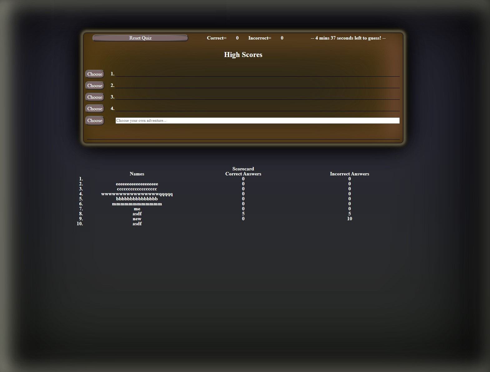
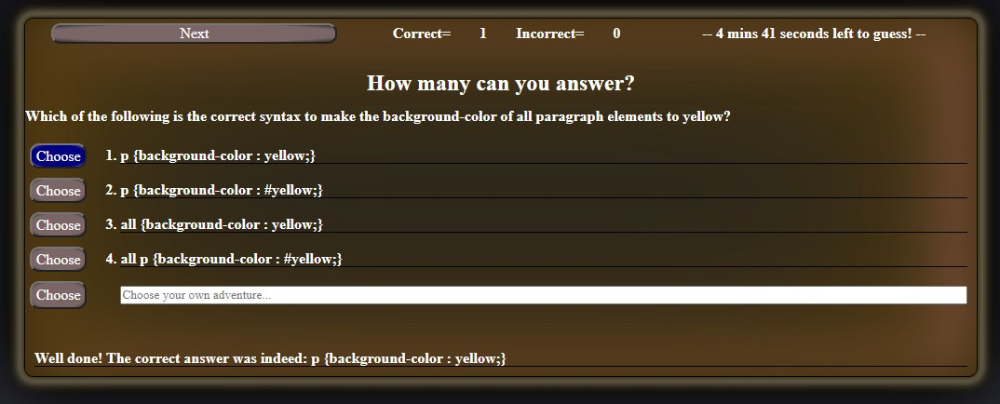

# Code Quiz

## Description 

This is as quiz of content covering HTML, CSS, Javascript, and JQuery.

## Table of Contents (Optional)

* [Installation](#installation)
* [Usage](#usage)
* [Final Product](#finalproduct)

### Installation

No installation is required; simply visit: https://blec333.github.io/Quiz/ to review my deployed quiz.

## Usage 

Click the begin-quiz button and you will be presented with the first question.  Make a choice, then use the next button (formerly the begin button) to step to the next question.

Once you complete the quiz, you will be asked if you would like to save your score by entering your name or initials.

## Final Product

Deployed Application
https://blec333.github.io/Quiz/

Github Repository
https://github.com/Blec333/Quiz

### Acknowledgements

©Brennan LeClair
